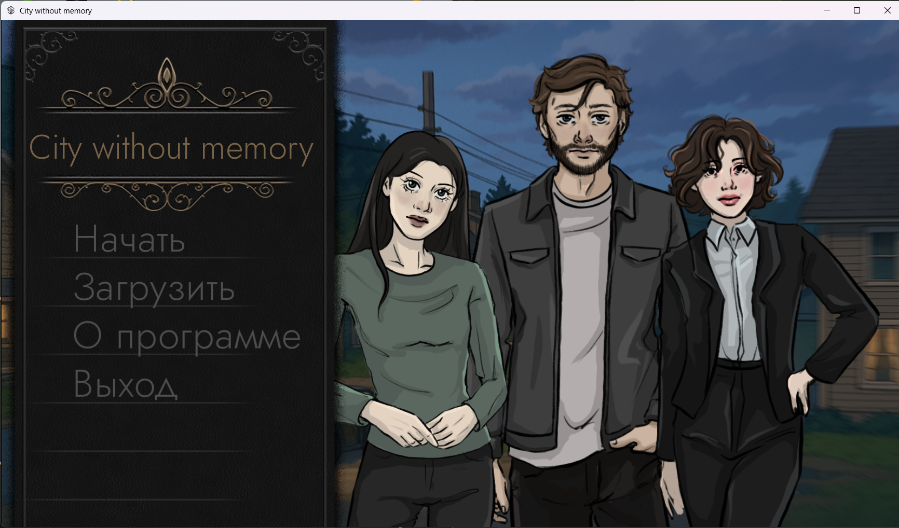
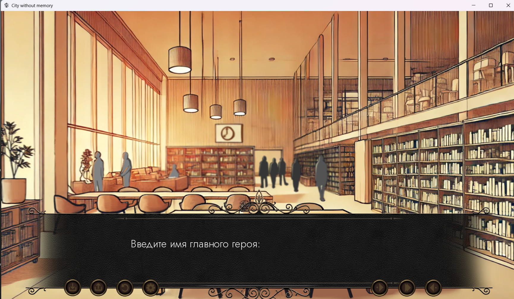
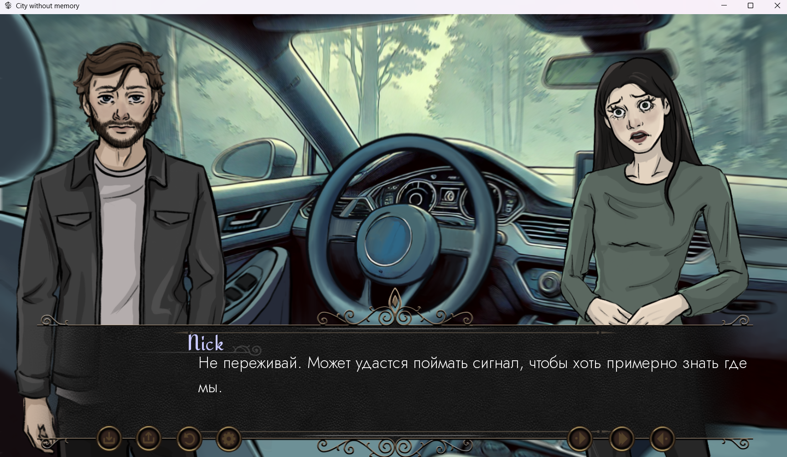
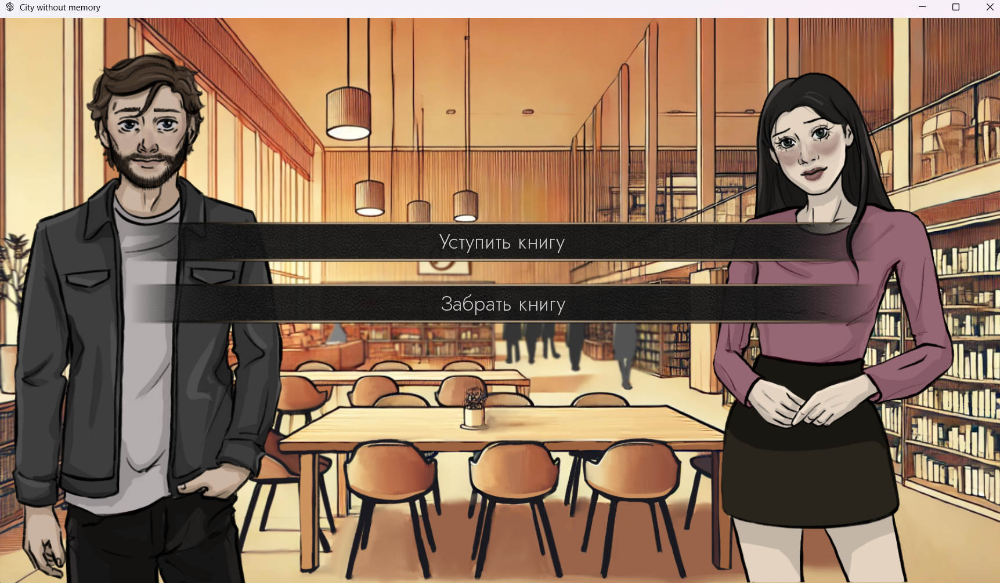

# 🌆 CityWithoutMemory

**CityWithoutMemory** is an original visual novel created with **Ren’Py**, exploring themes of memory, love, and loss.  
The story begins with a chance encounter in a library, gradually evolving into a journey through roads, cities, and memories.  
Through emotional dialogues and player choices, the inner conflicts of the characters and the mysterious nature of their world are revealed.

---

## Main Concept
The project explores how human feelings and memories shape personality and influence destiny.  
The player witnesses the gradual closeness of two people whose paths intersected at a moment when the past and present begin to blur.

> "A city without memory is a place where love becomes the last way to remember."

---

## Key Features
- Developed with **Ren’Py** (Python-based Visual Novel Engine)  
- Branching choice and consequence system  
- Multiple emotionally impactful endings  
- Atmospheric storytelling and visual style  
- Original script and artistic concept  

---

## 🖼️ Screenshots

|  |  |
|--------------------------------------|--------------------------------------|
|  |  |


---

## Technologies Used
- **Ren’Py 8.0+**  
- Python (built-in logic and branching system)  
- Branching narrative structure  
- Original graphical assets and UI design  

---

## How to Run
1. Download or clone the repository:  
   ```bash
   git clone https://github.com/1aroslavik/CityWithoutMemory.git
2. Install Ren’Py 8.0+

3. Open the project using the Ren’Py Launcher

4. Run the game
---
## Year of Development
2025

## Author's Role

- Script and storytelling
- Implementing choice logic in Ren’Py
- Working with visual scenes, sound, and pacing
---
- Character and Interface Design

@nasturra
